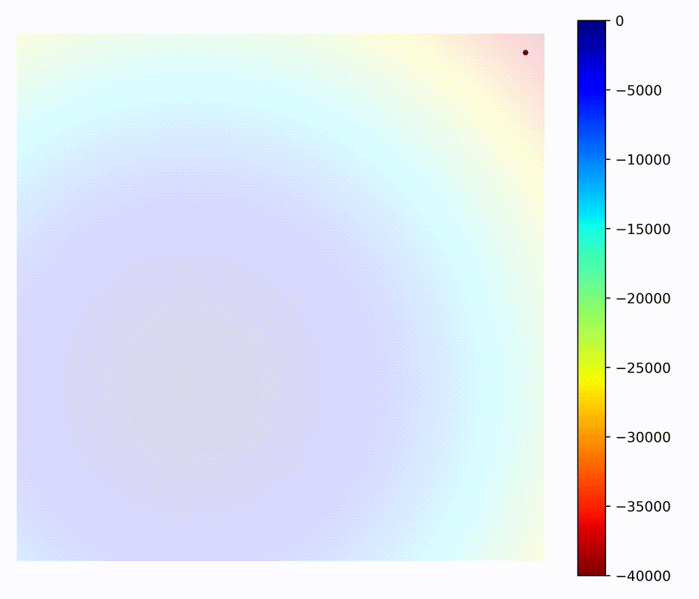

## Welcome to hyperactive

<p align="center">
  <a href="https://github.com/SimonBlanke/Hyperactive"></a>
</p>

**A unified interface for optimization algorithms and problems.**

Hyperactive implements a collection of optimization algorithms, accessible through a unified experiment-based
interface that separates optimization problems from algorithms. The library provides native implementations of algorithms from the Gradient-Free-Optimizers
package alongside direct interfaces to Optuna and scikit-learn optimizers, supporting discrete, continuous, and mixed parameter spaces.


<br>

---

| | [Overview](https://github.com/SimonBlanke/Hyperactive#overview) • [Installation](https://github.com/SimonBlanke/Hyperactive#installation) • [Tutorial](https://nbviewer.org/github/SimonBlanke/hyperactive-tutorial/blob/main/notebooks/hyperactive_tutorial.ipynb) • [API reference](https://simonblanke.github.io/hyperactive-documentation/5.0/) • [Citation](https://github.com/SimonBlanke/Hyperactive#citing-hyperactive) |
|---|---|
| **Open&#160;Source** | [](https://opensource.org/licenses/MIT) [](https://gc-os-ai.github.io/) |
| **Community** | [](https://discord.gg/7uKdHfdcJG) [](https://www.linkedin.com/company/german-center-for-open-source-ai)  |
| **CI/CD** | [](https://github.com/SimonBlanke/hyperactive/actions/workflows/test.yml) [](https://www.hyperactive.net/en/latest/?badge=latest)
| **Code** |  [](https://pypi.org/project/hyperactive/) [](https://www.python.org/) [](https://github.com/psf/black)  |

## Installation

```console
pip install hyperactive
```

## :zap: Quickstart

### Maximizing a custom function

```python
import numpy as np

# function to be maximized
def problem(params):
    x = params["x"]
    y = params["y"]

    return -(x**2 + y**2)

# discrete search space: dict of iterable, scikit-learn like grid space
# (valid search space types depends on optimizer)
search_space = {
    "x": np.arange(-1, 1, 0.01),
    "y": np.arange(-1, 2, 0.1),
}

from hyperactive.opt.gfo import HillClimbing

hillclimbing = HillClimbing(
    search_space=search_space,
    n_iter=100,
    experiment=problem,
)

# running the hill climbing search:
best_params = hillclimbing.solve()
```

### experiment abstraction - example: scikit-learn CV experiment

"experiment" abstraction = parametrized optimization problem

`hyperactive` provides a number of common experiments, e.g.,
`scikit-learn` cross-validation experiments:

```python
import numpy as np
from hyperactive.experiment.integrations import SklearnCvExperiment
from sklearn.datasets import load_iris
from sklearn.svm import SVC
from sklearn.metrics import accuracy_score
from sklearn.model_selection import KFold

X, y = load_iris(return_X_y=True)

# create experiment
sklearn_exp = SklearnCvExperiment(
    estimator=SVC(),
    scoring=accuracy_score,
    cv=KFold(n_splits=3, shuffle=True),
    X=X,
    y=y,
)

# experiments can be evaluated via "score"
params = {"C": 1.0, "kernel": "linear"}
score, add_info = sklearn_exp.score(params)

# they can be used in optimizers like above
from hyperactive.opt.gfo import HillClimbing

search_space = {
    "C": np.logspace(-2, 2, num=10),
    "kernel": ["linear", "rbf"],
}

hillclimbing = HillClimbing(
    search_space=search_space,
    n_iter=100,
    experiment=sklearn_exp,
)

best_params = hillclimbing.solve()
```

### full ML toolbox integration - example: scikit-learn

Any `hyperactive` optimizer can be combined with the ML toolbox integrations!

`OptCV` for tuning `scikit-learn` estimators with any `hyperactive` optimizer:

```python
# 1. defining the tuned estimator:
from sklearn.svm import SVC
from hyperactive.integrations.sklearn import OptCV
from hyperactive.opt.gfo import HillClimbing

search_space = {"kernel": ["linear", "rbf"], "C": [1, 10]}
optimizer = HillClimbing(search_space=search_space, n_iter=20)
tuned_svc = OptCV(SVC(), optimizer)

# 2. fitting the tuned estimator:
from sklearn.datasets import load_iris
from sklearn.model_selection import train_test_split
X, y = load_iris(return_X_y=True)
X_train, X_test, y_train, y_test = train_test_split(X, y, test_size=0.2)

tuned_svc.fit(X_train, y_train)

y_pred = tuned_svc.predict(X_test)

# 3. obtaining best parameters and best estimator
best_params = tuned_svc.best_params_
best_estimator = tuned_svc.best_estimator_
```

## :bulb: Key Concepts

### Experiment-Based Architecture

Hyperactive v5 introduces a clean separation between optimization algorithms and optimization problems through the **experiment abstraction**:

- **Experiments** define *what* to optimize (the objective function and evaluation logic)
- **Optimizers** define *how* to optimize (the search strategy and algorithm)

This design allows you to:
- Mix and match any optimizer with any experiment type
- Create reusable experiment definitions for common ML tasks
- Easily switch between different optimization strategies
- Build complex optimization workflows with consistent interfaces

**Built-in experiments include:**
- `SklearnCvExperiment` - Cross-validation for sklearn estimators
- `SktimeForecastingExperiment` - Time series forecasting optimization
- Custom function experiments (pass any callable as experiment)



## Overview

<h3 align="center">
Hyperactive features a collection of optimization algorithms that can be used for a variety of optimization problems. The following table shows examples of its capabilities:
</h3>


<br>

<table>
  <tbody>
    <tr align="center" valign="center">
      <td>
        <strong>Optimization Techniques</strong>
        
      </td>
      <td>
        <strong>Framework Integrations</strong>
        
      </td>
      <td>
        <strong>Optimization Applications</strong>
        
      </td>
    </tr>
    <tr/>
    <tr valign="top">
      <td>
        <a><b>Local Search:</b></a>
          <ul>
            <li><a href="./examples/gfo/hill_climbing_example.py">Hill Climbing</a></li>
            <li><a href="./examples/gfo/repulsing_hill_climbing_example.py">Repulsing Hill Climbing</a></li>
            <li><a href="./examples/gfo/simulated_annealing_example.py">Simulated Annealing</a></li>
            <li><a href="./examples/gfo/downhill_simplex_example.py">Downhill Simplex Optimizer</a></li>
         </ul><br>
        <a><b>Global Search:</b></a>
          <ul>
            <li><a href="./examples/gfo/random_search_example.py">Random Search</a></li>
            <li><a href="./examples/gfo/grid_search_example.py">Grid Search</a></li>
            <li><a href="./examples/gfo/random_restart_hill_climbing_example.py">Random Restart Hill Climbing</a></li>
            <li><a href="./examples/gfo/stochastic_hill_climbing_example.py">Stochastic Hill Climbing</a></li>
            <li><a href="./examples/gfo/powells_method_example.py">Powell's Method</a></li>
            <li><a href="./examples/gfo/pattern_search_example.py">Pattern Search</a></li>
         </ul><br>
        <a><b>Population Methods:</b></a>
          <ul>
            <li><a href="./examples/gfo/parallel_tempering_example.py">Parallel Tempering</a></li>
            <li><a href="./examples/gfo/particle_swarm_example.py">Particle Swarm Optimizer</a></li>
            <li><a href="./examples/gfo/spiral_optimization_example.py">Spiral Optimization</a></li>
            <li><a href="./examples/gfo/genetic_algorithm_example.py">Genetic Algorithm</a></li>
            <li><a href="./examples/gfo/evolution_strategy_example.py">Evolution Strategy</a></li>
            <li><a href="./examples/gfo/differential_evolution_example.py">Differential Evolution</a></li>
          </ul><br>
        <a><b>Sequential Methods:</b></a>
          <ul>
            <li><a href="./examples/gfo/bayesian_optimization_example.py">Bayesian Optimization</a></li>
            <li><a href="./examples/gfo/lipschitz_optimizer_example.py">Lipschitz Optimization</a></li>
            <li><a href="./examples/gfo/direct_algorithm_example.py">Direct Algorithm</a></li>
            <li><a href="./examples/gfo/tree_structured_parzen_estimators_example.py">Tree of Parzen Estimators</a></li>
            <li><a href="./examples/gfo/forest_optimizer_example.py">Forest Optimizer</a>
            [<a href="#references">ref</a>] </li>
          </ul><br>
        <a><b>Optuna Backend:</b></a>
          <ul>
            <li><a href="./examples/optuna/tpe_sampler_example.py">TPE Optimizer</a></li>
            <li><a href="./examples/optuna/random_sampler_example.py">Random Optimizer</a></li>
            <li><a href="./examples/optuna/cmaes_sampler_example.py">CMA-ES Optimizer</a></li>
            <li><a href="./examples/optuna/gp_sampler_example.py">Gaussian Process Optimizer</a></li>
            <li><a href="./examples/optuna/grid_sampler_example.py">Grid Optimizer</a></li>
            <li><a href="./examples/optuna/nsga_ii_sampler_example.py">NSGA-II Optimizer</a></li>
            <li><a href="./examples/optuna/nsga_iii_sampler_example.py">NSGA-III Optimizer</a></li>
            <li><a href="./examples/optuna/qmc_sampler_example.py">QMC Optimizer</a></li>
          </ul>
      </td>
      <td>
        <a><b>AI and Machine Learning:</b></a>
          <ul>
              <li><a href="./examples/integrations/README.md">scikit-learn</a></li>
              <li><a href="./examples/integrations/README.md">sktime forecasting</a></li>
              <li><a href="./examples/integrations/README.md">sktime time series classification</a></li>
          </ul>
      </td>
      <td>

      </td>
    </tr>
  </tbody>
</table>

The examples above are not necessarily done with realistic datasets or training procedures.
The purpose is fast execution of the solution proposal and giving the user ideas for interesting usecases.


<br>

## Sideprojects and Tools

The following packages are designed to support Hyperactive and expand its use cases.

| Package                                                                       | Description                                                                          |
|-------------------------------------------------------------------------------|--------------------------------------------------------------------------------------|
| [Search-Data-Collector](https://github.com/SimonBlanke/search-data-collector) | Simple tool to save search-data during or after the optimization run into csv-files. |
| [Search-Data-Explorer](https://github.com/SimonBlanke/search-data-explorer)   | Visualize search-data with plotly inside a streamlit dashboard.


<br>

## FAQ

#### Known Errors + Solutions

<details>
<summary><b> Read this before opening a bug-issue </b></summary>

<br>

- <b>Are you sure the bug is located in Hyperactive? </b>

  The error might be located in the optimization-backend.
  Look at the error message from the command line. <b>If</b> one of the last messages look like this:
     - File "/.../gradient_free_optimizers/...", line ...

  <b>Then</b> you should post the bug report in:
     - https://github.com/SimonBlanke/Gradient-Free-Optimizers

  <br>Otherwise</b> you can post the bug report in Hyperactive

- <b>Do you have the correct Hyperactive version? </b>

  Every major version update (e.g. v2.2 -> v3.0) the API of Hyperactive changes.
  Check which version of Hyperactive you have. If your major version is older you have two options:

  <b>Recommended:</b> You could just update your Hyperactive version with:
  ```bash
  pip install hyperactive --upgrade
  ```
  This way you can use all the new documentation and examples from the current repository.

  Or you could continue using the old version and use an old repository branch as documentation.
  You can do that by selecting the corresponding branch. (top right of the repository. The default is "main")
  So if your major version is older (e.g. v2.1.0) you can select the 2.x.x branch to get the old repository for that version.

- <b>Provide example code for error reproduction </b>
  To understand and fix the issue I need an example code to reproduce the error.
  I must be able to just copy the code into a py-file and execute it to reproduce the error.

</details>


<details>
<summary> MemoryError: Unable to allocate ... for an array with shape (...) </summary>

<br>

This is expected of the current implementation of smb-optimizers. For all Sequential model based algorithms you have to keep your eyes on the search space size:
```python
search_space_size = 1
for value_ in search_space.values():
    search_space_size *= len(value_)

print("search_space_size", search_space_size)
```
Reduce the search space size to resolve this error.

</details>


<details>
<summary> TypeError: cannot pickle '_thread.RLock' object </summary>

<br>

This typically means your search space or parameter suggestions include non-serializable
objects (e.g., classes, bound methods, lambdas, local functions, locks). Ensure that all
values in `search_space`/`param_space` are plain Python/scientific types such as ints,
floats, strings, lists/tuples, or numpy arrays. Avoid closures and non-top-level callables
in parameter values.

Hyperactive v5 does not expose a global “distribution” switch. If you parallelize outside
Hyperactive (e.g., with joblib/dask/ray), choose an appropriate backend and make sure the
objective and arguments are picklable for process-based backends.

</details>


<details>
<summary> Command line full of warnings </summary>

<br>

Very often warnings from sklearn or numpy. Those warnings do not correlate with bad performance from Hyperactive. Your code will most likely run fine. Those warnings are very difficult to silence.

It should help to put this at the very top of your script:
```python
def warn(*args, **kwargs):
    pass


import warnings

warnings.warn = warn
```

</details>


<details>
<summary> Warning: Not enough initial positions for population size </summary>

<br>

This warning occurs because the optimizer needs more initial positions to generate a
population for the search. In v5, initial positions are controlled via the optimizer’s
`initialize` parameter.
```python
# This is how it looks per default
initialize = {"grid": 4, "random": 2, "vertices": 4}

# You could set it to this for a maximum population of 20
initialize = {"grid": 4, "random": 12, "vertices": 4}
```

</details>


<br>

## References

#### [dto] [Scikit-Optimize](https://github.com/scikit-optimize/scikit-optimize/blob/master/skopt/learning/forest.py)

<br>

## Citing Hyperactive

    @Misc{hyperactive2021,
      author =   {{Simon Blanke}},
      title =    {{Hyperactive}: An optimization and data collection toolbox for convenient and fast prototyping of computationally expensive models.},
      howpublished = {\url{https://github.com/SimonBlanke}},
      year = {since 2019}
    }


<br>

## License

[](https://github.com/SimonBlanke/Hyperactive/blob/main/LICENSE)
