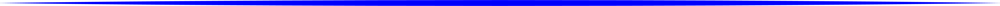
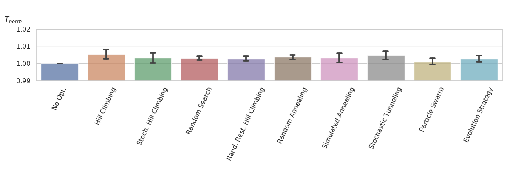

<h1 align="center">
  <a href="https://github.com/SimonBlanke/Hyperactive"></a>
</h1>

<h2 align="center">A hyperparameter optimization toolbox for convenient and fast prototyping</h3>

<p align="center">
  
  <a href="https://travis-ci.com/SimonBlanke/Hyperactive">
    
  </a>
 
  <a href="https://coveralls.io/github/SimonBlanke/Hyperactive">
    
  </a>
 
  <a href="https://app.codacy.com/project/SimonBlanke/Hyperactive/dashboard">
    
  </a>

  <a href="https://codeclimate.com/github/SimonBlanke/Hyperactive">
    
  </a>

  <a href="https://www.codefactor.io/repository/github/simonblanke/hyperactive">
    
  </a>
  
</p>

<br>

---

<p align="center">
  <a href="https://github.com/SimonBlanke/Hyperactive#overview">Overview</a> |
  <a href="https://github.com/SimonBlanke/Hyperactive#performance">Performance</a> |
  <a href="https://github.com/SimonBlanke/Hyperactive#installation">Installation</a> |
  <a href="https://github.com/SimonBlanke/Hyperactive#examples">Examples</a> |
  <a href="https://github.com/SimonBlanke/Hyperactive#hyperactive-api">Hyperactive API</a> |
  <a href="https://github.com/SimonBlanke/Hyperactive#license">License</a>
</p>

---


<br>

## Overview

- Optimize hyperparameters of machine- or deep-learning models, using a simple API.
- Choose from a variety of different [optimization techniques](https://github.com/SimonBlanke/Hyperactive/tree/master/hyperactive/optimizers#optimization-techniques) to improve your model.
- Utilize [advanced features](https://github.com/SimonBlanke/Hyperactive/tree/master/hyperactive#advanced-features) to improve the performance of all optimization techniques.


<table>
  <tbody>
    <tr align="center" valign="bottom">
      <td>
        <b>Optimization Techniques</b>
        
      </td>
      <td>
        <b>Supported Packages</b>
        
      </td>
      <td>
        <b>Advanced Features</b>
        
      </td>
    </tr>
    <tr/>
    <tr valign="top">
      <td>
        <a> <a href="https://github.com/SimonBlanke/Hyperactive/tree/master/hyperactive/optimizers#local-search">Local Search:</a> </a>
          <ul>
            <li>Hill Climbing</li>
            <li>Stochastic Hill Climbing</li>
            <li>Tabu Search</li>
         </ul>
        <a> <a href="https://github.com/SimonBlanke/Hyperactive/tree/master/hyperactive/optimizers#random-methods">Random Methods:</a> </a>
          <ul>
            <li>Random Search</li>
            <li>Random Restart Hill Climbing</li>
            <li>Random Annealing</li>
         </ul>
        <a> <a href="https://github.com/SimonBlanke/Hyperactive/tree/master/hyperactive/optimizers#markov-chain-monte-carlo">Markov Chain Monte Carlo:</a> </a>
          <ul>
            <li>Simulated Annealing</li>
            <li>Stochastic Tunneling</li>
            <li>Parallel Tempering</li>
          </ul>
        <a> <a href="https://github.com/SimonBlanke/Hyperactive/tree/master/hyperactive/optimizers#population-methods">Population Methods:</a> </a>
          <ul>
            <li>Particle Swarm Optimizer</li>
            <li>Evolution Strategy</li>
          </ul>
        <a> <a href="https://github.com/SimonBlanke/Hyperactive/tree/master/hyperactive/optimizers#sequential-methods">Sequential Methods:</a> </a>
          <ul>
            <li>Bayesian Optimization</li>
          </ul>
      </td>
      <td>
        <a>Machine Learning:</a>
          <ul>
              <li>Scikit-learn</li>
              <li>XGBoost</li>
              <li>LightGBM</li>
              <li>CatBoost</li>
          </ul>
        <a>Deep Learning:</a>
          <ul>
              <li>Keras</li>
          </ul>
        <a>Distribution:</a>
          <ul>
              <li>Multiprocessing</li>
          </ul>
      </td>
      <td>
        <a>Position initialization:</a>
          <ul>
              <li>Scatter initialization</li>
              <li>Warm-start</li>
          </ul>
        <a>Resources allocation:</a>
          <ul>
            <li>Memory</li>
          </ul>
        <a>Weight initialization:</a>
          <ul>
            <li>Transfer-learning</li>
          </ul>
      </td>
    </tr>
  </tbody>
</table>

<br>

## Performance

The bar chart below shows, that the optimization process itself represents only a small fraction (<0.6%) of the computation time.
The 'No Opt'-bar shows the training time of a default Gradient-Boosting-Classifier normalized to 1. The other bars show the computation time relative to 'No Opt'. Each optimizer did 30 runs of 300 iterations, to get a good statistic.

<p align="center">

</p>


<br>


## Installation

Hyperactive is developed and tested in python 3:


<br>

Hyperactive is available on PyPi:

 


```console
pip install hyperactive
```

<br>


## Examples

<details><summary>Basic sklearn example:</summary>
<p>

```python
from sklearn.datasets import load_iris
from sklearn.model_selection import train_test_split

from hyperactive import SimulatedAnnealingOptimizer

iris_data = load_iris()
X = iris_data.data
y = iris_data.target

X_train, X_test, y_train, y_test = train_test_split(X, y, test_size=0.33)

# this defines the model and hyperparameter search space
search_config = {
    "sklearn.ensemble.RandomForestClassifier": {
        "n_estimators": range(10, 100, 10),
        "max_depth": [3, 4, 5, 6],
        "criterion": ["gini", "entropy"],
        "min_samples_split": range(2, 21),
        "min_samples_leaf": range(2, 21),
    }
}

Optimizer = SimulatedAnnealingOptimizer(search_config, n_iter=100, n_jobs=4)

# search best hyperparameter for given data
Optimizer.fit(X_train, y_train)

# predict from test data
prediction = Optimizer.predict(X_test)

# calculate accuracy score
score = Optimizer.score(X_test, y_test)
```

</p>
</details>


<details><summary>Example with a multi-layer-perceptron in keras:</summary>
<p>

```python
from sklearn.datasets import load_breast_cancer
from sklearn.model_selection import train_test_split
from hyperactive import ParticleSwarmOptimizer

breast_cancer_data = load_breast_cancer()

X = breast_cancer_data.data
y = breast_cancer_data.target

X_train, X_test, y_train, y_test = train_test_split(X, y, test_size=0.33)

# this defines the structure of the model and the search space in each layer
search_config = {
    "keras.compile.0": {"loss": ["binary_crossentropy"], "optimizer": ["adam"]},
    "keras.fit.0": {"epochs": [3], "batch_size": [100], "verbose": [0]},
    "keras.layers.Dense.1": {
        "units": range(5, 15),
        "activation": ["relu"],
        "kernel_initializer": ["uniform"],
    },
    "keras.layers.Dense.2": {
        "units": range(5, 15),
        "activation": ["relu"],
        "kernel_initializer": ["uniform"],
    },
    "keras.layers.Dense.3": {"units": [1], "activation": ["sigmoid"]},
}

Optimizer = ParticleSwarmOptimizer(
    search_config, n_iter=3, metric=["mean_absolute_error"], verbosity=0
)
# search best hyperparameter for given data
Optimizer.fit(X_train, y_train)
```

</p>
</details>


<details><summary>Example with a convolutional neural network in keras:</summary>
<p>

```python
import numpy as np

from keras.datasets import mnist
from keras.utils import to_categorical

from hyperactive import RandomSearchOptimizer

(X_train, y_train), (X_test, y_test) = mnist.load_data()

X_train = X_train.reshape(60000, 28, 28, 1)
X_test = X_test.reshape(10000, 28, 28, 1)

y_train = to_categorical(y_train)
y_test = to_categorical(y_test)


# this defines the structure of the model and the search space in each layer
search_config = {
    "keras.compile.0": {"loss": ["categorical_crossentropy"], "optimizer": ["adam"]},
    "keras.fit.0": {"epochs": [20], "batch_size": [500], "verbose": [2]},
    "keras.layers.Conv2D.1": {
        "filters": [32, 64, 128],
        "kernel_size": range(3, 4),
        "activation": ["relu"],
        "input_shape": [(28, 28, 1)],
    },
    "keras.layers.MaxPooling2D.2": {"pool_size": [(2, 2)]},
    "keras.layers.Conv2D.3": {
        "filters": [16, 32, 64],
        "kernel_size": [3],
        "activation": ["relu"],
    },
    "keras.layers.MaxPooling2D.4": {"pool_size": [(2, 2)]},
    "keras.layers.Flatten.5": {},
    "keras.layers.Dense.6": {"units": range(30, 200, 10), "activation": ["softmax"]},
    "keras.layers.Dropout.7": {"rate": list(np.arange(0.4, 0.8, 0.1))},
    "keras.layers.Dense.8": {"units": [10], "activation": ["softmax"]},
}

Optimizer = RandomSearchOptimizer(search_config, n_iter=20)

# search best hyperparameter for given data
Optimizer.fit(X_train, y_train)

# predict from test data
prediction = Optimizer.predict(X_test)

# calculate accuracy score
score = Optimizer.score(X_test, y_test)
```

</p>
</details>

<br>

## Hyperactive API

### Classes:
```python

HillClimbingOptimizer(search_config, n_iter, metric="accuracy", n_jobs=1, cv=5, verbosity=1, random_state=None, warm_start=False, memory=True, scatter_init=False, eps=1, r=1e-6)
StochasticHillClimbingOptimizer(search_config, n_iter, metric="accuracy", n_jobs=1, cv=5, verbosity=1, random_state=None, warm_start=False, memory=True, scatter_init=False)
TabuOptimizer(search_config, n_iter, metric="accuracy", n_jobs=1, cv=5, verbosity=1, random_state=None, warm_start=False, memory=True, scatter_init=False, eps=1, tabu_memory=[3, 6, 9])

RandomSearchOptimizer(search_config, n_iter, metric="accuracy", n_jobs=1, cv=5, verbosity=1, random_state=None, warm_start=False, memory=True, scatter_init=False)
RandomRestartHillClimbingOptimizer(search_config, n_iter, metric="accuracy", n_jobs=1, cv=5, verbosity=1, random_state=None, warm_start=False, memory=True, scatter_init=False, n_restarts=10)
RandomAnnealingOptimizer(search_config, n_iter, metric="accuracy", n_jobs=1, cv=5, verbosity=1, random_state=None, warm_start=False, memory=True, scatter_init=False, eps=100, t_rate=0.98)

SimulatedAnnealingOptimizer(search_config, n_iter, metric="accuracy", n_jobs=1, cv=5, verbosity=1, random_state=None, warm_start=False, memory=True, scatter_init=False, eps=1, t_rate=0.98)
StochasticTunnelingOptimizer(search_config, n_iter, metric="accuracy", n_jobs=1, cv=5, verbosity=1, random_state=None, warm_start=False, memory=True, scatter_init=False, eps=1, t_rate=0.98, n_neighbours=1, gamma=1)
ParallelTemperingOptimizer(search_config, n_iter, metric="accuracy", n_jobs=1, cv=5, verbosity=1, random_state=None, warm_start=False, memory=True, scatter_init=False, eps=1, t_rate=0.98, n_neighbours=1, system_temps=[0.1, 0.2, 0.01], n_swaps=10)

ParticleSwarmOptimizer(search_config, n_iter, metric="accuracy", n_jobs=1, cv=5, verbosity=1, random_state=None, warm_start=False, memory=True, scatter_init=False, n_part=4, w=0.5, c_k=0.5, c_s=0.9)
EvolutionStrategyOptimizer(search_config, n_iter, metric="accuracy", n_jobs=1, cv=5, verbosity=1, random_state=None, warm_start=False, memory=True, scatter_init=False, individuals=10, mutation_rate=0.7, crossover_rate=0.3)

BayesianOptimizer(search_config, n_iter, metric="accuracy", n_jobs=1, cv=5, verbosity=1, random_state=None, warm_start=False, memory=True, scatter_init=False)

```

<br>

### General positional argument:

| Argument | Type | Description |
| ------ | ------ | ------ |
| search_config  | dict | hyperparameter search space to explore by the optimizer |
| n_iter | int | number of iterations to perform |

<br>

### General keyword arguments:

| Argument | Type | Default | Description |
| ------ | ------ | ------ | ------ |
| metric  | str | "accuracy" | metric for model evaluation |
| n_jobs | int | 1 | number of jobs to run in parallel (-1 for maximum) |
| cv | int | 5 | cross-validation |
| verbosity | int | 1 | Shows model and metric information |
| random_state | int | None | The seed for random number generator |
| warm_start | dict | None | Hyperparameter configuration to start from |
| memory  |  bool | True  |  Stores explored evaluations in a dictionary to save computing time |
| scatter_init  |  int | False  |  Chooses better initial position by training on multiple random positions with smaller training dataset (split into int subsets)  |

<br>

### Specific keyword arguments:

#### [Hill Climbing](https://github.com/SimonBlanke/Hyperactive/blob/master/hyperactive/optimizers/local/hill_climbing_optimizer.py)

| Argument | Type | Default | Description |
| ------ | ------ | ------ | ------ |
| eps  | int | 1 | epsilon |


#### [Stochastic Hill Climbing](https://github.com/SimonBlanke/Hyperactive/blob/master/hyperactive/optimizers/local/stochastic_hill_climbing.py)

| Argument | Type | Default | Description |
| ------ | ------ | ------ | ------ |
| eps  | int | 1 | epsilon |
|  r | float  |  1e-6 | acceptance factor  |


#### [Tabu Search](https://github.com/SimonBlanke/Hyperactive/blob/master/hyperactive/optimizers/local/tabu_search.py)

| Argument | Type | Default | Description |
| ------ | ------ | ------ | ------ |
| eps  | int | 1 | epsilon |
|  tabu_memory | list  |  [3, 6, 9] | length of short/mid/long-term memory  |

#### [Random Restart Hill Climbing](https://github.com/SimonBlanke/Hyperactive/blob/master/hyperactive/optimizers/random/random_restart_hill_climbing.py)

| Argument | Type | Default | Description |
| ------ | ------ | ------ | ------ |
| eps  | int | 1 | epsilon |
| n_restarts  | int  | 10  | number of restarts  |


#### [Random Annealing](https://github.com/SimonBlanke/Hyperactive/blob/master/hyperactive/optimizers/random/random_annealing.py)


| Argument | Type | Default | Description |
| ------ | ------ | ------ | ------ |
| eps  | int | 100 | epsilon |
| t_rate | float | 0.98 | cooling rate  |

#### [Simulated Annealing](https://github.com/SimonBlanke/Hyperactive/blob/master/hyperactive/optimizers/monte_carlo/simulated_annealing.py)

| Argument | Type | Default | Description |
| ------ | ------ | ------ | ------ |
| eps  | int | 1 | epsilon |
| t_rate | float | 0.98 | cooling rate  |

#### [Stochastic Tunneling](https://github.com/SimonBlanke/Hyperactive/blob/master/hyperactive/optimizers/monte_carlo/stochastic_tunneling.py)

| Argument | Type | Default | Description |
| ------ | ------ | ------ | ------ |
| eps  | int | 1 | epsilon |
| t_rate | float | 0.98 | cooling rate  |
| gamma  | float  |  1 | tunneling factor  |


#### [Parallel Tempering](https://github.com/SimonBlanke/Hyperactive/blob/master/hyperactive/optimizers/monte_carlo/parallel_tempering.py)

| Argument | Type | Default | Description |
| ------ | ------ | ------ | ------ |
| eps  | int | 1 | epsilon |
| t_rate | float | 0.98 | cooling rate  |
| system_temps  | list  |  [0.1, 0.2, 0.01] | initial temperatures (number of elements defines number of systems)  |
|  n_swaps | int  | 10  | number of swaps  |


#### [Particle Swarm Optimization](https://github.com/SimonBlanke/Hyperactive/blob/master/hyperactive/optimizers/population/particle_swarm_optimization.py)

| Argument | Type | Default | Description |
| ------ | ------ | ------ | ------ |
| n_part  | int | 1 | number of particles |
| w | float | 0.5 | intertia factor |
| c_k | float | 0.8 | cognitive factor |
| c_s | float | 0.9 | social factor |

#### [Evolution Strategy](https://github.com/SimonBlanke/Hyperactive/blob/master/hyperactive/optimizers/population/evolution_strategy.py)

| Argument | Type | Default | Description |
| ------ | ------ | ------ | ------ |
| individuals  | int | 10 | number of individuals |
| mutation_rate | float | 0.7 | mutation rate |
| crossover_rate | float | 0.3 | crossover rate |

#### [Bayesian Optimization](https://github.com/SimonBlanke/Hyperactive/blob/master/hyperactive/optimizers/sequence_model/bayesian_optimization.py)

| Argument | Type | Default | Description |
| ------ | ------ | ------ | ------ |
| kernel  | class | Matern | Kernel used for the gaussian process |

<br>

### General methods:
```
fit(self, X_train, y_train)
```
| Argument | Type | Description |
| ------ | ------ | ------ |
| X_train  | array-like | training input features |
| y_train | array-like | training target |

```
predict(self, X_test)
```
| Argument | Type | Description |
| ------ | ------ | ------ |
| X_test  | array-like | testing input features |

```
score(self, X_test, y_test)
```
| Argument | Type | Description |
| ------ | ------ | ------ |
| X_test  | array-like | testing input features |
| y_test | array-like | true values |

```
export(self, filename)
```
| Argument | Type | Description |
| ------ | ------ | ------ |
| filename  | str | file name and path for model export |

<br>

### Available Metrics:

|  Scores |  Losses |
| ------ | ------ |
| accuracy_score | brier_score_loss |
| balanced_accuracy_score | log_loss |
| average_precision_score | max_error |
| f1_score | mean_absolute_error |
| recall_score | mean_squared_error |
| jaccard_score | mean_squared_log_error |
| roc_auc_score | median_absolute_error |
| explained_variance_score |  |


<br>

## License


